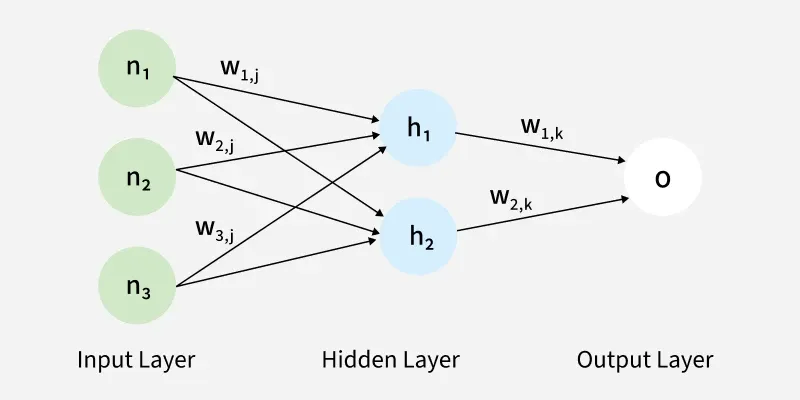

# neural_cpp



A small C++ neural-network project that trains a handwritten-digit classifier on MNIST. The project includes a minimal `Tensor` class with automatic differentiation, matrix/vector operations, activation functions, softmax, cross-entropy-style loss construction, and SGD parameter updates.

## Project Layout

```text
.
├── main.cpp              # Builds and trains the MNIST classifier
├── classes/tensor.cpp    # Minimal tensor + autodiff implementation
├── data/mnist.cpp        # MNIST download and IDX file loading helpers
├── utils/utils.cpp       # Random vector/matrix initialization helpers
├── CMakeLists.txt        # CMake build target
└── CMakePresets.json     # Local compiler preset
```

## What `main.cpp` Does

`main.cpp` is the training script for the project. It:

1. Locates the MNIST data directory under `data/mnist`.
2. Downloads and extracts the MNIST files if they are not already present.
3. Loads the train and test datasets into memory.
4. Creates a 3-layer fully connected neural network:
   - Input: `784` pixels
   - Hidden layer 1: `512` units + ReLU
   - Hidden layer 2: `512` units + ReLU
   - Output: `10` logits, one per digit class
5. Trains for `10` epochs using:
   - Learning rate: `0.0005`
   - Batch size: `32`
   - Loss: negative log probability of the correct class
   - Optimizer: SGD
6. Runs validation on the MNIST test set and prints final accuracy.

The forward pass is written directly with tensor operations:

```cpp
std::shared_ptr<Tensor> h1 = *input_x * weights_1;
std::shared_ptr<Tensor> h1_b = *h1 + bias_1;
std::shared_ptr<Tensor> h1_relu = h1_b->relu();
```

Loss is computed from `softmax`, `log`, a dot product with a one-hot target vector, and `neg()`:

```cpp
std::shared_ptr<Tensor> probs = logits->softmax();
std::shared_ptr<Tensor> log_probs = probs->log();
std::shared_ptr<Tensor> dot_log_probs = *log_probs * target;
std::shared_ptr<Tensor> loss = dot_log_probs->neg();
```

Calling `loss->backward()` walks the computation graph and accumulates gradients into the trainable tensors.

## What `classes/tensor.cpp` Provides

`Tensor` is a simple autodiff-enabled data structure. It supports:

- Scalar, 1D vector, and 2D matrix storage using `std::vector<float>`
- Shape tracking with `std::vector<std::size_t>`
- Optional gradient tracking through `requires_grad`
- Parent links and gradient callbacks for backpropagation
- Gradient accumulation with `add_to_grad`
- Gradient clearing with `zero_grad`
- SGD updates with `sgd_step`

Supported operations include:

- `operator+` for scalar/vector/matrix addition where implemented
- `operator*` for dot products and matrix-vector/vector-matrix multiplication
- `relu()`
- `softmax()`
- `log()`
- `neg()`
- `backward()`

The class is designed around `std::shared_ptr<Tensor>` so operation results can keep references to their parent tensors while backpropagation runs.

## Build

This project uses CMake.

```bash
cmake -S . -B out/build
cmake --build out/build
```

If you want to use the included preset:

```bash
cmake --preset "GCC 14.2.0 x86_64-apple-darwin24"
cmake --build "out/build/GCC 14.2.0 x86_64-apple-darwin24"
```

The preset expects GCC 14 at:

```text
/usr/local/bin/gcc-14
/usr/local/bin/g++-14
```

If those compilers are not installed, use the generic CMake commands above or edit `CMakePresets.json`.

## Run

After building, run the executable:

```bash
./out/build/neural_cpp
```

Or, if using the preset:

```bash
./out/build/GCC\ 14.2.0\ x86_64-apple-darwin24/neural_cpp
```

On the first run, the program may download MNIST with `curl` and extract it with `gunzip`. The raw dataset files are stored in:

```text
data/mnist/
```

Expected output includes epoch progress, average loss, and final validation accuracy.

## Notes

- `main.cpp` includes `.cpp` files directly instead of separate headers and compilation units. This keeps the project simple, but larger C++ projects usually split declarations into `.h`/`.hpp` files and compile `.cpp` files separately.
- `Tensor::backward()` currently expects the output tensor to be a scalar.
- The implementation is intentionally educational and minimal. It favors readability over performance, so training MNIST may be much slower than using optimized libraries.
